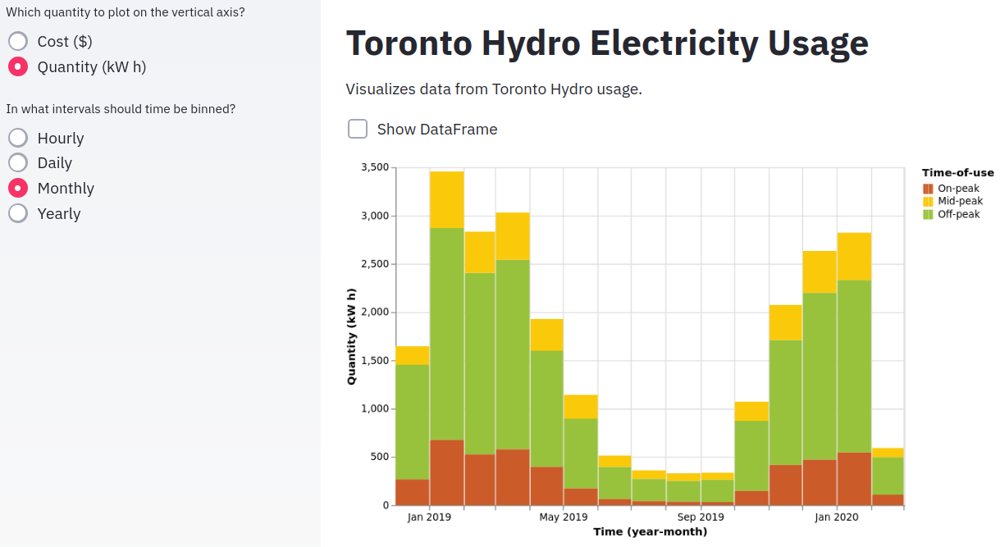

# Overview

This is a small project to scrape and visualize an individual's Toronto Hydro electricity usage data using the framework [`streamlit`](https://www.streamlit.io/) to create a quick web frontend and uses [`altair`](https://altair-viz.github.io/) for interactive plotting. The scraper involves some basic HTML parsing (though note the included cert is necessary to bypass Toronto Hydro's misconfigured SSL) as there's no API for accessing usage data.

Instructions:

1. Set up a new conda environment from `environment.yml`.
2. Specify values for the environment variables `TORONTOHYDRO_USERNAME` and `TORONTOHYDRO_PASSWORD`.
3. Run the command: `streamlit run visualize_usage.py`

Mostly just experimenting with streamlit, but hoping to include tracking against historical weather (available from weather.gc.ca) along with basic time-series forecasting at some point!

# Screenshot

